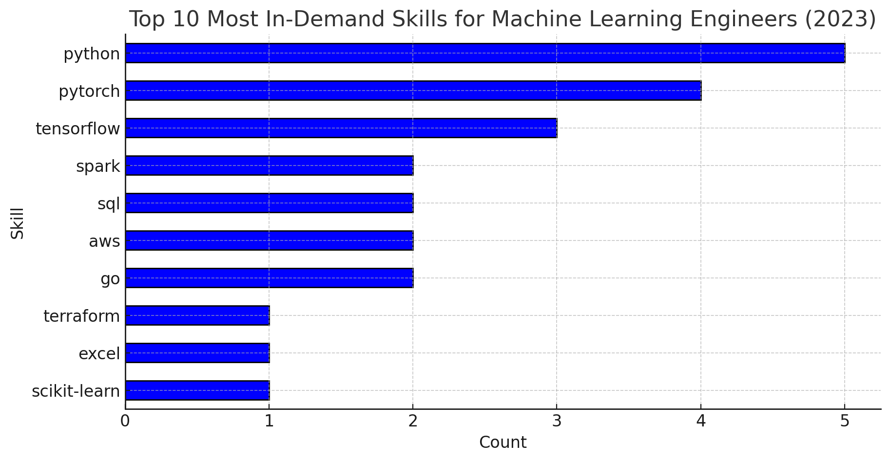

# Introduction
📊 This project takes a deep dive into **Machine Learning Engineer** jobs in the U.S., exploring the **best-paying roles**, the most **in-demand skills**, and where you can find the mix of **high demand** and **great salaries** in the Machine Learning Engineer field.

🔍 [SQL Queries](/project_sql/)

# Background
This project was created to make navigating the **Machine Learning** job market easier, with a focus on identifying **top-paying roles** and the most **in-demand skills** — helping others streamline their job search and land the best opportunities.

### My SQL queries aimed to answer:
1. What are the top-paying Machine Learning Engineer jobs in the U.S.?
2. What skills are required for these top-paying jobs?
3. What skills are most in demand for Machine Learning jobs in the U.S.?
4. Which skills are associated with higher salaries?
5. What are the most optimal skills to learnn?
# Tools I Used
- **SQL & PostgreSQL** – Used to extract, clean, and analyze job market data.  
- **VS Code** – Served as the primary workspace for writing and executing SQL queries.  
- **Git & GitHub** – Enabled version control and collaboration, ensuring a structured and trackable workflow.
# The Analysis
### 1. Top-Paying Machine Learning Engineer Jobs in the U.S.

```sql
SELECT 
    job_id,
    job_title,
    job_location,
    salary_year_avg,
    job_posted_date,
    name AS company_name
FROM job_postings_fact
LEFT JOIN 
    company_dim 
    ON job_postings_fact.company_id=company_dim.company_id
WHERE 
    job_title_short = 'Machine Learning Engineer' 
    AND job_country = 'United States' 
    AND salary_year_avg IS NOT NULL
ORDER BY 
    salary_year_avg DESC
LIMIT 10;
```

**Insights from the Top-Paying Machine Learning Engineer Jobs in the U.S. (2023)**
Based on the provided data of the top 10 highest-paying Machine Learning Engineer jobs in the U.S. for 2023, here are key insights:

**1. Highest-Paying Job:**
**"Senior AI Platform Engineer"** at **Nvidia** (Santa Clara, CA) tops the list with an average annual salary of **$315,000**.

**2. Salary Distribution**:
The top three highest-paying roles exceed $280,000 per year:

- **Nvidia** – $315,000

- **Orbit** – $300,000

- **OpenAI** – $285,000

The lowest in this dataset is ADP's Machine Learning Scientist role at $228,000.

**3. Geographical Insights**:
**California** **dominates** with 6 out of the 10 jobs being based there (Santa Clara, San Francisco, San Jose, Los Altos, Berkeley).

**New York** and New **Jersey** also appear in the top-paying job locations.

**4. Companies Offering Top Salaries:**
**Big tech companies** and **AI-focused firms** are leading in offering high salaries:

Nvidia, OpenAI, TikTok, Samsung, JPMorgan Chase, ADP

Financial institutions (JPMorgan Chase) are also investing in ML talent.

**5. Trends in Machine Learning Careers:**
Research-oriented roles (e.g., "Research Scientist, Machine Learning" at OpenAI) are among the highest paid.

AI platform and system architecture jobs (e.g., "Senior AI Platform Engineer" at Nvidia) command high salaries.

Risk data mining and predictive sciences (TikTok and JPMorgan) indicate the growing demand for ML in finance and security.

Visualizing the Data:


Understanding the Chart:
The horizontal bar chart displays the top-paying Machine Learning Engineer jobs in the U.S. (2023).

**Nvidia's "Senior AI Platform Engineer"** leads with the highest salary of **$315,000**.

ADP's "Machine Learning Scientist" is the lowest in this dataset at $228,000.

Research and AI platform roles dominate the high-salary range.

Big tech companies and financial institutions are the primary employers offering top ML salaries


### 2. Skills for top paying Machine Learning Engineer Jobs in the U.S.

```sql
WITH top_paying_jobs AS (SELECT 
    job_id,
    job_title,
    job_location,
    salary_year_avg,
    job_posted_date,
    name AS company_name
FROM job_postings_fact
LEFT JOIN 
    company_dim ON job_postings_fact.company_id=company_dim.company_id
WHERE 
    job_title_short = 'Machine Learning Engineer' 
    AND job_country = 'United States' 
    AND salary_year_avg IS NOT NULL
ORDER BY 
    salary_year_avg DESC
LIMIT 10
)

SELECT 
    top_paying_jobs.*,
    skills_dim.skills
FROM top_paying_jobs
INNER JOIN 
    skills_job_dim ON top_paying_jobs.job_id=skills_job_dim.job_id
INNER JOIN
    skills_dim ON skills_job_dim.skill_id=skills_dim.skill_id
ORDER BY
    salary_year_avg DESC;
```

**Insights from Skill Analysis**:
- **Python** is the most in-demand skill, appearing in 5 job listings. This aligns with its widespread use in machine learning.

- **PyTorch** (4 listings) and TensorFlow (3 listings) are the most popular deep learning frameworks.

- **Big Data and Cloud Skills:** Spark (2), SQL (2), AWS (2), and Go (2) indicate the importance of handling large datasets and cloud computing.

Other notable skills include Terraform (1), Excel (1), and Scikit-Learn (1), which suggests a mix of infrastructure automation, data processing, and traditional ML tools.

The bar chart visually represents these trends.


### 3. In-Demanded Machine Learning Engineer Skills in the U.S.

```sql
SELECT 
    skills_dim.skills,
    COUNT(skills_job_dim.job_id) as demand_count
FROM job_postings_fact
INNER JOIN 
    skills_job_dim ON job_postings_fact.job_id=skills_job_dim.job_id
INNER JOIN
    skills_dim ON skills_job_dim.skill_id=skills_dim.skill_id
WHERE
    job_title_short = 'Machine Learning Engineer' 
    AND job_country = 'United States' 
GROUP BY
    skills_dim.skills
ORDER BY
    demand_count DESC
LIMIT 10;
```

**Insights on the Top 10 Most Demanded Skills for Machine Learning Engineers in the U.S. (2023)**

**1. Python Dominates the ML Landscape**
Python (662 job postings) is the most in-demand skill, reflecting its widespread use in ML frameworks like TensorFlow, PyTorch, and Scikit-learn.

**2. SQL is Crucial for Data Handling**
SQL (308 job postings) is the second most sought-after skill, emphasizing the importance of database management and data querying for ML models.

**3. TensorFlow vs. PyTorch**
TensorFlow (287 job postings) slightly outpaces PyTorch (266 job postings), indicating both frameworks are nearly equally relevant.

**4. Cloud & Big Data are Essential**
AWS (281) and Azure (172) highlight the demand for cloud computing in ML deployment. Spark (229) shows the need for big data processing skills.

**5. Java & R Have Niche Importance**
Java (219) is still valuable for ML in production environments. R (163) is relevant in data science but trails Python significantly.

**6. Scikit-learn is Popular for Traditional ML**
Scikit-learn (146), though ranked last, remains essential for classical ML algorithms.

| Rank | Skill          | Demand Count |
|------|--------------|--------------|
| 1    | Python       | 662          |
| 2    | SQL         | 308          |
| 3    | TensorFlow  | 287          |
| 4    | AWS         | 281          |
| 5    | PyTorch     | 266          |
| 6    | Spark       | 229          |
| 7    | Java        | 219          |
| 8    | Azure       | 172          |
| 9    | R           | 163          |
| 10   | Scikit-learn| 146          |


### 4. Top-Paying Machine Learning Engineer Skills in the U.S.

```sql
SELECT 
    skills_dim.skills,
    ROUND (AVG(salary_year_avg), 0) AS salary_year_avg_per_skill
FROM job_postings_fact
INNER JOIN 
    skills_job_dim ON job_postings_fact.job_id=skills_job_dim.job_id
INNER JOIN
    skills_dim ON skills_job_dim.skill_id=skills_dim.skill_id
WHERE
    job_title_short = 'Machine Learning Engineer' 
    AND job_country = 'United States' 
    AND salary_year_avg IS NOT NULL
GROUP BY
    skills_dim.skills
ORDER BY
    salary_year_avg_per_skill DESC
LIMIT 30;
```

Here are some key trends and insights from the top 30 highest-paying skills for Machine Learning Engineers in the U.S. in 2023:

**1. Functional Programming Languages Lead in Salaries**
Haskell ($213K) and Julia ($213K) are at the top of the list, suggesting a high demand for functional programming in machine learning.

These languages are often used in high-performance computing, mathematical modeling, and research applications.

**2. Traditional Languages Still Command High Pay**
C ($196K), Golang ($194K), TypeScript ($181K), and Scala ($171K) show strong salaries, reflecting their role in backend systems, distributed computing, and performance-critical applications.

C++ ($157K) and Java ($158K) also remain valuable for enterprise applications, performance engineering, and ML production systems.

**3. Data Engineering & Cloud Skills Are Highly Valued**
BigQuery ($165K), Hadoop ($162K), Snowflake ($159K), PostgreSQL ($160K), and MongoDB ($160K) highlight the importance of big data and scalable database solutions.

GCP ($155K), AWS ($153K), and Terraform ($168K) demonstrate the demand for cloud expertise in ML deployment.

**4. Machine Learning Frameworks & Tools** Are Key
PyTorch ($162K), Spark ($168K), TensorFlow ($154K), and Airflow ($169K) show strong salaries, reinforcing the need for ML model deployment, orchestration, and distributed processing.

**5. Surprising High Salaries for Frontend & Miscellaneous Skills**
HTML ($195K) and CSS ($195K)—Unexpectedly high for frontend skills, suggesting the rise of ML-powered web applications and interactive AI-driven interfaces.

Excel ($189K)—Likely tied to business intelligence, financial modeling, and data analysis in ML workflows.

GitHub ($163K)—Indicates the value of collaboration, version control, and MLOps best practices.

This also can be indicated on this bar chart


### 5. Most Optimal Machine Learning Engineer Skills in the U.S.
```sql
SELECT 
    skills_dim.skill_id,
    skills_dim.skills,
    COUNT(skills_job_dim.skill_id) AS demand_count,
    ROUND(AVG(salary_year_avg),0) AS salary_year_avg_per_skill
FROM 
    job_postings_fact
INNER JOIN 
    skills_job_dim ON job_postings_fact.job_id=skills_job_dim.job_id
INNER JOIN 
    skills_dim ON skills_job_dim.skill_id=skills_dim.skill_id
WHERE
    job_title_short = 'Machine Learning Engineer'
    AND job_country = 'United States'
    AND salary_year_avg IS NOT NULL 
GROUP BY
    skills_dim.skill_id
HAVING
    COUNT(skills_dim.skill_id)>=15
ORDER BY
    salary_year_avg_per_skill DESC,
    demand_count DESC
LIMIT 30;
```
**Insights on Optimal Skills (High-Paying & High-Demand) ML Roles (2023)**

**1. Spark Leads in Salary**
Apache Spark offers the highest salary ($168,801) and remains highly demanded (21 listings), emphasizing the importance of big data processing in ML.

**2. Deep Learning Frameworks Pay Well**
PyTorch ($162,052, 47 listings) and TensorFlow ($154,796, 51 listings) dominate, showing the demand for deep learning expertise.

**3. Cloud Platforms Are Key**
AWS ($153,913, 32 listings), Azure ($153,021, 15 listings), and GCP ($155,038, 16 listings) confirm that cloud ML deployment is crucial.

**4. Python Is Most Demanded, But Not Highest Paid**
Python (84 listings) has the highest demand but ranks 10th in salary ($151,977), showing it’s an essential but common skill.

**5. Kubernetes & Go Are Emerging**
Kubernetes ($144,464) and Go ($156,197) show increasing importance in ML model deployment and infrastructure.


| Rank | Skill        | Demand Count | Avg Salary (USD) |
|------|-------------|--------------|------------------|
| 1    | Spark       | 21           | 168,801          |
| 2    | PyTorch     | 47           | 162,052          |
| 3    | Java        | 32           | 158,649          |
| 4    | C++         | 16           | 157,662          |
| 5    | Go          | 17           | 156,197          |
| 6    | GCP         | 16           | 155,038          |
| 7    | TensorFlow  | 51           | 154,796          |
| 8    | AWS         | 32           | 153,913          |
| 9    | Azure       | 15           | 153,021          |
| 10   | Python      | 84           | 151,977          |
| 11   | Scikit-learn| 18           | 149,444          |
| 12   | SQL         | 32           | 145,023          |
| 13   | Kubernetes  | 15           | 144,464          |
| 14   | R           | 20           | 132,352          |

# What I Learned
- **SQL & Query Optimization** – Improved my ability to write efficient queries, optimize database performance, and extract meaningful insights from large datasets.
- **Workflow Efficiency** – Enhanced my workflow with shortcuts and integrations, making SQL querying more efficient.
- **Version Control** – Strengthened my version control skills, helping me track changes and manage projects systematically.
# Conclusion
- **The highest-paying ML jobs in the U.S.** are **dominated by big tech**, AI research, and financial institutions. Nvidia, OpenAI, and TikTok lead the market, with salaries exceeding $280,000 per year.
- **Top-paying Machine Learning Engineer roles in 2023** demand expertise in Python, deep learning frameworks (PyTorch, TensorFlow), big data tools (Spark, SQL), and cloud platforms (AWS). Companies also seek skills in infrastructure automation (Terraform, Go) and traditional ML libraries (Scikit-Learn), emphasizing the need for scalable, production-ready AI solutions. Mastering these technologies significantly boosts job prospects in high-paying ML roles.
- **Machine learning engineers must be proficient** in Python, SQL, cloud platforms (AWS/Azure), and deep learning frameworks (TensorFlow/PyTorch) to stay competitive in 2023.
- **The highest-paying skills for ML engineers in 2023** highlight a strong demand for functional programming (Haskell, Julia - $213K), low-level languages (C - $196K), and backend development (Golang - $194K). Cloud & big data expertise (BigQuery, Snowflake, AWS) and ML frameworks (PyTorch, TensorFlow) also command high salaries, reflecting the need for scalable ML deployment. **Surprisingly,** frontend (HTML, CSS - $195K) and Excel ($189K) rank high, suggesting a rise in ML-powered web applications and data analysis roles. 
- **Most Optimal Machine Learning Engineer Skills in the U.S:** Machine learning engineers should focus on deep learning (PyTorch, TensorFlow), big data (Spark), and cloud computing (AWS, GCP, Azure) to maximize salary potential. Python and SQL remain must-have foundational skills, but cloud and deployment expertise (Kubernetes, Go) can significantly increase earning potential.